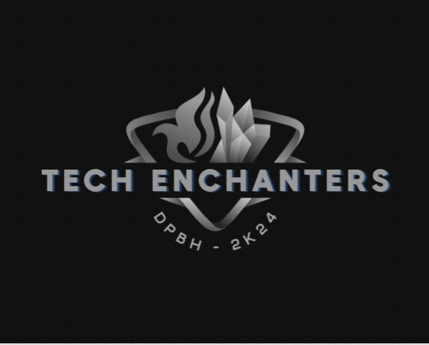

# Dark Pattern Detector Chrome Extension(ML+CNN)

## Introduction

Welcome to the Dark Pattern Detector Chrome Extension! This project aims to address the pervasive issue of dark patterns on the internet by leveraging machine learning and computer vision techniques. Dark patterns are user interface designs that manipulate users into making unintended decisions, often to benefit the service provider at the expense of the user.


## Project Overview

In this repository, we have developed a Chrome extension that serves as a tool to identify and combat dark patterns present on websites. Our solution employs a combination of a large dataset, machine learning algorithms, and computer vision to detect potential dark patterns in various forms - from text-based tricks to image-based manipulations.

## Features

### 1. Keyword Detection

Our Chrome extension utilizes a meticulously curated dataset to train a machine learning model capable of identifying keywords associated with dark patterns. By analyzing the content of web pages, the extension can flag potential instances of deceptive practices.

### 2. Python Machine Learning Module

To enhance precision, we've integrated a Python-based machine learning module into our solution. This module is capable of scanning any URL provided, analyzing the webpage's content, and identifying potential dark patterns. Additionally, users can input specific texts they find suspicious, allowing the model to evaluate and provide insights.

### 3. Image Analysis with CNN

To address dark patterns embedded in images, we've incorporated Convolutional Neural Networks (CNNs) into our solution. The extension can now scan images on webpages, identifying visual elements that may contribute to deceptive user experiences.

## Getting Started

To use the Dark Pattern Detector Chrome Extension, follow these steps:

1. Clone this repository to your local machine.
   ```bash
   git clone https://github.com/45KNIGHT45/dpbh-TechEnchanters.git
   ```

2. Open Google Chrome and navigate to `chrome://extensions/`.

3. Enable "Developer mode" in the top-right corner.

4. Click on "Load unpacked" and select the directory where you cloned the repository.

5. The Dark Pattern Detector extension should now appear in your Chrome toolbar.

## Usage

1. Click on the Dark Pattern Detector icon in the toolbar.

2. Enter a URL or paste suspicious text in the input field.

3. Let the extension analyze the content and provide insights on potential dark patterns.

4. Enjoy a safer and more transparent online experience!

## Contributions

We welcome contributions from the open-source community. Feel free to submit issues, feature requests, or pull requests. Together, we can make the internet a more user-friendly and trustworthy space.

## License

This project is licensed under the [MIT License](LICENSE). Feel free to use, modify, and distribute the code for your own purposes.

---

Thank you for your interest in the Dark Pattern Detector Chrome Extension. We hope our solution contributes to a more ethical and user-centric online environment.
